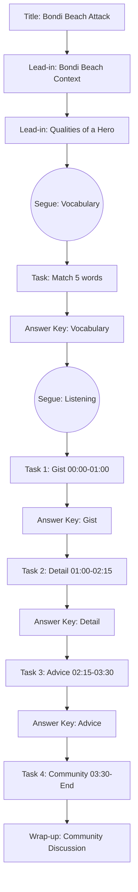

```mermaid
graph TD
    Title[Title: Bondi Beach Attack] --> LeadIn1[Lead-in: Bondi Beach Context]
    LeadIn1 --> LeadIn2[Lead-in: Qualities of a Hero]
    LeadIn2 --> VocabSegue((Segue: Vocabulary))
    VocabSegue --> VocabMatch[Task: Match 5 words]
    VocabMatch --> VocabKey[Answer Key: Vocabulary]
    VocabKey --> ListenSegue((Segue: Listening))
    ListenSegue --> Task1[Task 1: Gist 00:00-01:00]
    Task1 --> Task1Key[Answer Key: Gist]
    Task1Key --> Task2[Task 2: Detail 01:00-02:15]
    Task2 --> Task2Key[Answer Key: Detail]
    Task2Key --> Task3[Task 3: Advice 02:15-03:30]
    Task3 --> Task3Key[Answer Key: Advice]
    Task3Key --> Task4[Task 4: Community 03:30-End]
    Task4 --> Speaking[Wrap-up: Community Discussion]
```
