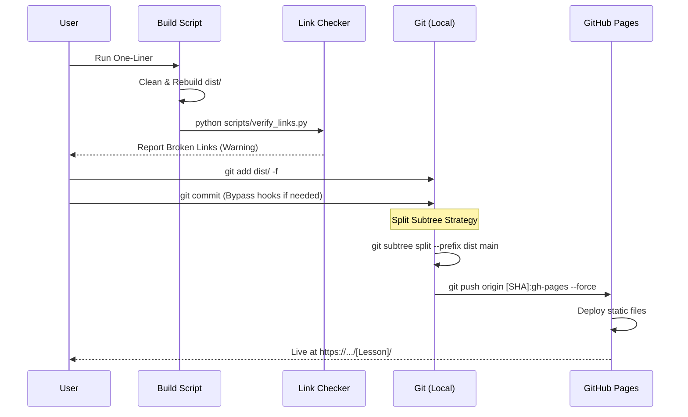

# Deployment Architecture & Workflows

**System Version**: 2.1 (The "Verified Zero Overwrite" Standard)
**Repository**: `actions-gh-pages`
**Live URL**: `https://elwrush.github.io/actions-gh-pages/`

This document details the automated system for building, verifying, and deploying Reveal.js presentations to GitHub Pages. It solves the "overwrite problem" by using a strictly structured subfolder architecture with a shared engine core.

## 1. Core Concepts

### A. The "Zero Overwrite" Strategy
To prevent new deployments from wiping out existing presentations, the build system aggregates content into a clean `dist/` folder where:
1.  **Root**: Contains the Dashboard (`index.html`) and the Shared Engine (`dist/`, `plugin/`).
2.  **Subfolders**: Each lesson gets a dedicated folder (e.g., `dist/31-01-2026-Pronunciation-Bell/`).
3.  **Independence**: Lessons are self-contained *content* but share *infrastructure*.

### B. Shared Engine Architecture
Instead of copying 5MB of Reveal.js assets into every lesson folder, we host **one** engine at the root.
- **Engine Location**: `https://elwrush.github.io/actions-gh-pages/dist/`
- **Lesson Reference**: All lessons link to `../dist/reveal.js` and `../dist/reveal.css`.

### C. Global Asset Pattern
Heavy media files (background videos, standard intro music) are stored centrally to reduce repo bloat.
- **Source**: `images/` (Project Root)
- **Deployment**: Copied to `dist/images/`
- **Reference**: Lessons link to `../images/mission_bg_clipped.mp4`.

## 2. Visual Workflows

### The Build Pipeline (`build_dist.js` + `verify_links.py`)

This script is the heart of the deployment system. It transforms the working directory (`inputs/`) into a deployable artifact (`dist/`).

```mermaid
graph TD
    subgraph Sources
        Input[inputs/FOLDER/published/index.html]
        Repo[temp_reveal_repo/dist & plugin]
        Assets[images/ (Global Media)]
    end

    subgraph BuildProcess ["Build & Quality Gate"]
        RepoCheck[0. Verify Repo (verify_repo.py)]
        Clean[1. Clean dist/]
        CopyEngine[2. Copy Engine & Plugins]
        CopyAssets[3. Copy Global Assets]
        Scan[4. Scan Inputs]
        Fix[5. Path Injection & Fixes]
        Verify[6. Verify Links (scripts/verify_links.py)]
        Dash[7. Generate Dashboard]
    end

    subgraph Artifact ["dist/ (Production)"]
        RootDist[dist/ (Engine)]
        RootImg[images/ (Global)]
        LessonFolder[Lesson-Folder/]
        LessonIndex[index.html]
        Dashboard[index.html (Dashboard)]
    end

    RepoCheck --> Clean
    Repo -->|Copy| CopyEngine
    Assets -->|Copy| CopyAssets
    Input -->|Read| Scan
    Scan -->|Transform href='../dist/'| Fix
    Fix -->|Write| LessonIndex
    LessonIndex --> Verify
    Verify --> Dash
    CopyEngine --> RootDist
    CopyAssets --> RootImg
    Dash --> Dashboard
```

### The Deployment Loop

How a change moves from the local machine to the live web.



## 3. Directory Structure

### Source (`inputs/`) vs. Build (`dist/`)

| Source Path (Working Tree) | Production Path (GitHub Pages) | Purpose |
|:---|:---|:---|
| `inputs/Lesson-A/published/index.html` | `/Lesson-A/index.html` | The Presentation |
| `temp_reveal_repo/dist/reveal.js` | `/dist/reveal.js` | The Engine (JS) |
| `temp_reveal_repo/css/reveal.css` | `/css/reveal.css` | The Engine (CSS) |
| `images/mission_bg.mp4` | `/images/mission_bg.mp4` | Shared Video |
| `(Generated dynamically)` | `/index.html` | The Dashboard |

## 4. Key Scripts

### `scripts/build_dist.js`
**Function**: The Orchestrator.
- **Dependencies**: Native Node.js `fs` (No `npm install` needed).
- **Key Logic**:
    - Recursively scans `inputs/` for `published/index.html`.
    - Regex-replaces local paths (`dist/reveal.js`) with relative paths (`../dist/reveal.js`).
    - Aggregates metadata (`<title>`) to build the dashboard.

### `scripts/verify_links.py`
**Function**: The Quality Gate.
- **Action**: Scans all HTML files in `dist/`.
- **Logic**: Resolves every `src` and `href` relative to the file and checks if the target exists on disk.
- **Benefit**: Catch 404 errors locally before pushing.

### `scripts/deploying-to-github-pages/scripts/sync_lesson_plan_url.py`
**Function**: The Documentation Sync.
- **Input**: A folder name.
- **Action**: Finds the `.typ` lesson plan.
- **Output**: Updates `#slideshow_link("...")` with the authoritative GitHub Pages URL.

## 5. Troubleshooting & Maintenance

### "404 Not Found" on Styles/Scripts
*   **Cause**: The `index.html` is looking for `dist/` (local) instead of `../dist/` (parent).
*   **Fix**: Run `node scripts/build_dist.js`. The script's regex replacer handles this automatically.

### "Video Not Playing"
*   **Cause**: Path mismatch.
*   **Fix**:
    *   **Shared Video**: Use `../images/video.mp4` in `presentation.json`.
    *   **Local Video**: Use `images/video.mp4` (and ensure it's in the lesson's `images` folder).

### "Deploy Rejected"
*   **Cause**: `gh-pages` branch has drifted or user is pushing to `main` instead of `gh-pages`.
*   **Fix**: Use the Force Push One-Liner:
    ```powershell
    $sha = git subtree split --prefix dist main; git push origin "$sha`:gh-pages" --force
    ```