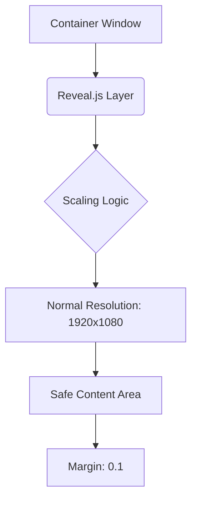
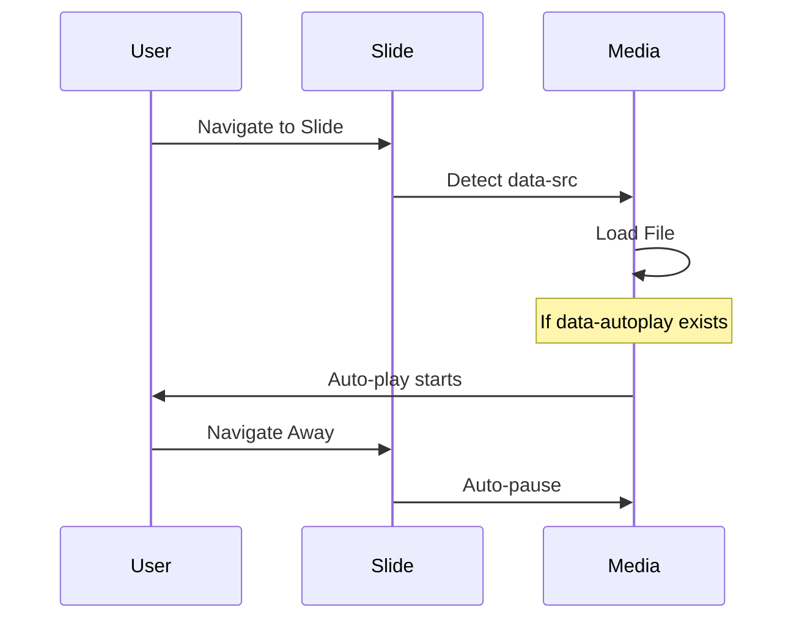

# Reveal.js Visual Reference Guide

A guide for building high-performance, classroom-ready presentations with multimedia capabilities.

---

## 🏗️ 1. Core Architecture & Sizing
Reveal.js uses a **"Normal" coordinate system**. It authors slides at one resolution and then scales them uniformly to fit any screen.



### 📐 Optimal Sizing for Classroom Displays
To prevent "malformed" slides where content is cut off, use **16:9 Full HD** settings:

```javascript
Reveal.initialize({
  width: 1920,
  height: 1080,
  margin: 0.1,      // 10% safety buffer
  minScale: 0.2,    // Allows scaling down on small screens
  maxScale: 2.0     // Allows scaling up on projectors
});
```

**Common Malformation Fixes:**
*   **Content Overflow**: If text is too large, use `<h2 class="r-fit-text">` to auto-scale.
*   **Vertical Spacing**: Use the `.r-stretch` class on an image/video to make it fill all remaining vertical space.

---

## 🎬 2. Multimedia Integration
Reveal.js supports automated loading and playback to save bandwidth and ensure smooth transitions.

### 🔊 Audio & 🎞️ Video Workflow
Use **Lazy Loading** (`data-src`) to prevent all media from loading at once.



**Implementation:**
```html
<!-- Local Video -->
<video data-autoplay data-src="videos/intro.mp4"></video>

<!-- Local Audio -->
<audio data-autoplay data-src="audio/correct-answer.mp3"></audio>
```

---

## 📺 3. YouTube Integration
YouTube requires an `<iframe>`. Reveal.js treats these as special assets.

**Syntax:**
```html
<iframe 
  data-src="https://www.youtube.com/embed/VIDEO_ID" 
  width="1000" 
  height="600" 
  frameborder="0" 
  allowfullscreen>
</iframe>
```

---

## 🧩 4. Layout Helpers (Visual Shortcuts)

| Class | Purpose | Visual Result |
| :--- | :--- | :--- |
| `.r-stack` | Layering elements | Elements sit on top of each other (good for reveals) |
| `.r-fit-text` | Scaling | Text fills the width of the slide perfectly |
| `.r-stretch` | Vertical Fill | Element takes up all space between header and footer |
| `.fragment` | Sequential Reveal | Element remains hidden until "Next" is pressed |

---

## 🛠️ 5. Initialization Checkpoint
Ensure your presentation is initialized with these modern defaults for the best experience:

```javascript
Reveal.initialize({
  hash: true,               // Direct URL to specific slides
  controls: true,           // On-screen navigation
  progress: true,           // Progress bar
  center: true,             // Vertical centering
  transition: 'slide',      // Standard smooth movement
  autoPlayMedia: null       // Respect data-autoplay on individual tags
});
```