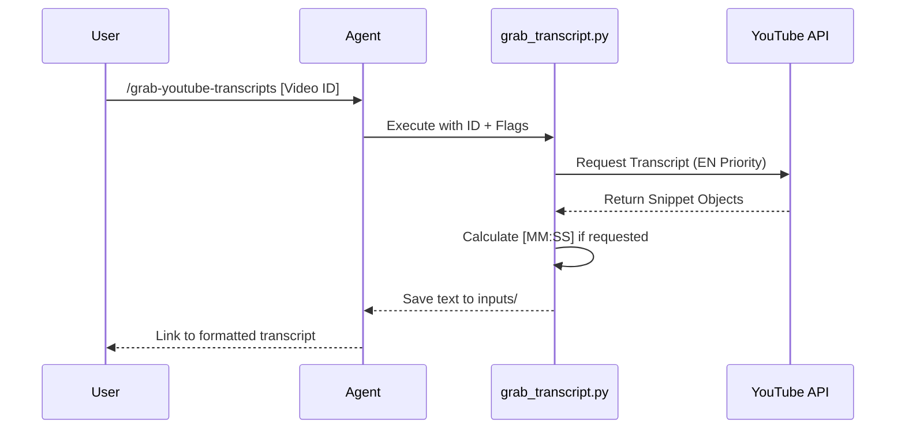

# Grabbing YouTube Transcripts

## Purpose
Retrieves full-text transcripts from YouTube videos when browser-based extraction fails. Provides a deterministic, programmatic fallback for content analysis.

## Workflow Visualization



## Workflow Steps

### Step 1: Identification
Extract the 11-char ID from the YouTube URL.
- *Example*: `7vJxJyTWBmc` from `youtube.com/watch?v=7vJxJyTWBmc`

### Step 2: Execution
Run the grabber script using the following patterns:

**Standard Extraction:**
```powershell
python skills/grabbing-youtube-transcripts/scripts/grab_transcript.py [VIDEO_ID] --output inputs/[TOPIC]/raw_content.md
```

**Timestamped Extraction (Recommended for Lesson Planning):**
```powershell
python skills/grabbing-youtube-transcripts/scripts/grab_transcript.py [VIDEO_ID] --output inputs/[TOPIC]/raw_content.md --timestamps
```

### Step 3: Verification
Open the generated file to ensure accuracy. If the script fails, refer to `REFERENCE.md#Troubleshooting`.

## Resources
- [REFERENCE.md](REFERENCE.md): CLI arguments, object models, and error handling.
- [youtube-transcript-api](https://pypi.org/project/youtube-transcript-api/): Official documentation.

