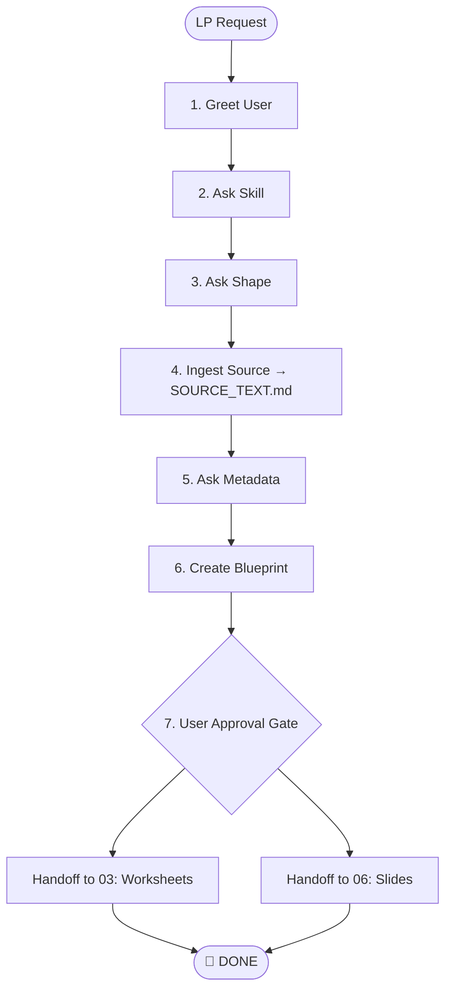

# Writing Lesson Plans

This skill guides you through a strictly interactive workflow to create pedagogical blueprints for lessons. **LP generation is officially legacy and disabled.** This skill now serves as the "Architectural Phase" for Ingestion and Blueprinting.

## 🛑 THE ONE TEMPLATE LAW
There is **one** template and **one** `stage()` helper. Do not reference, import, or use:
- `lesson-plan-components.typ`
- `lesson_plan.typ`
- `#lesson_header()`
- `#metadata_table()`
- `#stage_table()`
- Any Bell/Intensive branching logic

All of these are **DELETED AND LEGACY**. The single correct import is:
```typst
#import "/templates/modern_template.typ": modern_template, stage
```

## 🛑 MANDATORY: ZERO HALLUCINATION POLICY
**You MUST NOT guess Typst syntax.** Before you write or edit any `.typ` file, if you are unsure of a layout or table pattern, you **MUST** use **Skill 16** (`16-consulting-global-repos`) to consult the official Typst repository (`typst/typst`). The local `/lib/` folder is **DELETED and LEGACY**.

---

## 🛑 THE INTERACTIVE WORKFLOW (MANDATORY)

**Source Folder Continuity Law**: **CRITICAL**. If the user provides a source folder (e.g., `inputs/my-lesson-folder`), you MUST use that folder for all outputs. You are FORBIDDEN from creating a new lesson folder. If the folder name violates URL-friendly standards (spaces, underscores), rename it first using a shell command.

You must use the `ask_user` tool to complete the following steps **in sequence**. Do not assume any defaults.

1.  **Greeting**: Greet the user and introduce the lesson planning assistant.

2.  **Skill Identification**:
    - Output this enumerated list in your text response:
        1. Reading
        2. Listening
        3. Speaking
        4. Writing
        5. Grammar
        6. Vocabulary
        7. Pronunciation
        8. Functions
    - Then `ask_user` (type: 'text'): which skill does this lesson target?

3.  **Shape Selection**:
    - Output the shape list from `REFERENCE.md` in your text response.
    - Then `ask_user` (type: 'text'): which shape letter?

4.  **Phase 1: Ingestion (MANDATORY GATE)**:
    - `ask_user`: where are the source materials?
    - **EXTRACT ALL SOURCE TEXT** to a `SOURCE_TEXT.md` file in the lesson folder BEFORE proceeding.
    - **VERIFICATION TAGS**: Include `(Count: X)` tags for any numbered tasks, sentences, or response areas (e.g., `### Task 7 (Count: 6 sentences)`).

5.  **Metadata Check**: `ask_user` (type: 'text') to collect or confirm:
    - Date of Lesson
    - Week Number
    - Class(es)
    - CEFR Level
    - SB page number(s)
    - WB page number(s)
    - Resources
    - Slides URL (GitHub Pages link for this lesson)

6.  **Blueprint Generation**: Finalize the `lesson_plan_blueprint.md`.
    - **MANDATORY ITEMIZATION**: Every task or exercise number from source materials must appear explicitly.
    - **HANDOFF**: Once the blueprint is approved, proceed directly to **Skill 03** (Worksheets) or **Skill 06** (Slides).

7.  **User Review**: Present a plain-text summary and `ask_user` for approval.

8.  **Finalization**:
    - `lesson_plan_blueprint.md` remains in the lesson folder root for workflow tracking.
    - **LP generation (.typ) is EXCISED.**

---

## 🛑 THE PROCESS LOCKS (UNSKIPPABLE GATES)

1.  **LOCK 1: Metadata & Shape** — Complete `ask_user` workflow before writing any file.
2.  **LOCK 2: Blueprint Approval** — Present a Markdown blueprint and wait for explicit approval.
3.  **LOCK 3: handoff Gate** — Do not proceed to presentation design until Blueprint is approved.

---

## Visual Process


```mermaid
graph TD
    Start([LP Request]) --> Greet[1. Greet User]
    Greet --> AskSkill[2. Ask Skill]
    AskSkill --> AskShape[3. Ask Shape]
    AskShape --> Ingest[4. Ingest Source → SOURCE_TEXT.md]
    Ingest --> AskMeta[5. Ask Metadata]
    AskMeta --> Blueprint[6. Create Blueprint]
    Blueprint --> UserGate{7. User Approval Gate}
    UserGate --> Skill03[Handoff to 03: Worksheets]
    UserGate --> Skill06[Handoff to 06: Slides]
    Skill03 & Skill06 --> Finish([🏁 DONE])
```

---

## Gold Standard Example: Shape E (Receptive Skills)

### Stage 1: Lead-in ("The Interactive Hook")
- **Goal**: Engage and activate schemata.
- **Activity**: An interactive quiz requiring discussion/voting (e.g., "Fact or Fiction," "Two Truths, One Lie"). Avoid dry, direct questions.

### Stage 2: Pre-teach Vocab ("Barrier Removal")
- **Goal**: Remove lexical barriers.
- **Activity**: Select exactly **5** key vocabulary items. Present with English-only context sentences. Task MUST be matching or gap-fill. Conclude with modelling pronunciation and word stress.

### Stage 3: Gist / Scanning ("The Sub-Skill Workout")
- **Goal**: Practice a specific gist-reading sub-skill under timed conditions.
- **Activity**: Non-linear texts → timed "Speed Scan"; Linear texts → "Sequencing" or "Paragraph Matching."
- **Feedback**: MUST include asking students *how* they found the answer.

### Stage 4: Main Task — Detail ("The Data Detective")
- **Goal**: Practice reading for specific, detailed information.
- **Activity**: Locate precise data points, evidence, or answers to detailed comprehension questions.

### Stage 5: Post-task ("The Gold Standard Combo")
- **Goal**: Personalise the topic and recycle language.
- **Activity** (two-part):
    1. **Language Focus**: Brief targeted activity recycling language from the text.
    2. **Personalisation**: Open-ended discussion connecting topic to student opinions or experiences.

## Principles for All Other Shapes
- **Hooks over History**: Lead-ins must be interactive hooks, not historical summaries.
- **Recycle & Reuse**: Post-tasks should include a language-focus step before freer practice.
- **Clarity & Consistency**: Stage names must strictly match the options in `REFERENCE.md`.