# Writing Lesson Plans

This skill guides you through a strictly interactive 7-step workflow to create professional, pedagogically robust lesson plans.

## 🛑 MANDATORY: ZERO HALLUCINATION POLICY
**You MUST NOT guess Typst syntax.** Before you write or edit any `.typ` file (Step 6), if you are unsure of a layout, table, or list implementation, you **MUST** use the `consult_repo` tool (from skill 16) to check the official Typst repository (`typst:crates/typst-library/src/`). 

## 🛑 THE INTERACTIVE WORKFLOW (MANDATORY)

You must use the `ask_user` tool to complete the following steps in sequence. Do not assume any defaults (e.g., topic, level) unless explicitly provided by the user in the current session.

1.  **Greeting**: Greet the user and introduce the lesson planning assistant.
2.  **Skill Identification**: 
    - First, **output an enumerated list** of skills/systems in your text response:
        1. Reading
        2. Listening
        3. Speaking
        4. Writing
        5. Grammar
        6. Vocabulary
        7. Pronunciation
        8. Functions
    - Then, use `ask_user` (type: 'text') to ask for the selected skill number or name.
3.  **Shape Selection**: 
    - First, **output an enumerated list** of shapes (1-10) as defined in `REFERENCE.md` in your text response.
    - Then, use `ask_user` (type: 'text') to ask for the selected shape number or letter.
    - **Shapes**:
        1. **A**: Text-based Presentation
        2. **B**: Language Practice
        3. **C**: Test-Teach-Test (TTT)
        4. **D**: Situational Presentation (PPP)
        5. **E**: Receptive Skills
        6. **F**: Productive Skills
        7. **G**: Task-Based Learning (TBL)
        8. **H**: SCR Receptive Skills
        9. **I**: SCR Systems
        10. **J**: SCR Productive Skills
4.  **Material Source**: Use `ask_user` (type: 'choice') to establish if the lesson is **bespoke** (created from scratch) or **based on materials** (e.g., a specific textbook page or YouTube transcript).
5.  **Metadata Check**: Use `ask_user` (type: 'text') to collect or confirm:
    - Teacher Name
    - Date of Lesson
    - CEFR Level
    - Duration (Minutes)
    - Materials
6.  **Lesson Generation**: Write the lesson plan according to the selected shape and metadata. Use the "Gold Standard" principle to model the plan on high-quality existing examples.
    - **MANDATORY**: You MUST include the `#slideshow_link("https://elwrush.github.io/actions-gh-pages/[lesson-name]/")` function in every lesson plan (placed between the differentiation box and the stage table).
    - **MANDATORY**: Do NOT proceed to create worksheets automatically. You MUST ask the user for explicit permission before invoking the `03-producing-educational-materials` skill.
7.  **User Review**: Present the plan (or a summary) and ask for final approval before finalizing files.
8.  **Finalization & Publishing (MANDATORY)**:
    - Create a `published/` subdirectory inside the lesson folder.
    - Keep the final `.typ` file in the **root** of the lesson folder using the format: `DD-MM-YYYY-[LEVEL]-[TITLE]-LP.typ`.
    - Compile the PDF directly into `published/` using the format: `DD-MM-YYYY-[LEVEL]-[TITLE]-LP.pdf`.
    - Ensure `lesson_plan_blueprint.md` and `visual_plan.md` remain in the root of the lesson folder for workflow tracking.
    - **Never** put the `.typ` file in the `published/` folder; only finalized PDFs and assets belong there.

## The "Gold Standard" Principle
The core principle of this skill is to **model all new lesson plans on the best existing example for the chosen lesson shape.** Do not create from a generic template. Identify the project's "Gold Standard" for that shape and replicate its pedagogical patterns and activity styles.

## 🛑 THE PROCESS LOCKS (UNSKIPPABLE GATES)
To prevent "hallucination-led planning" or jumping ahead, this project utilizes **Programmatic Session Hooks**.

1.  **LOCK 1: Metadata & Shape**: You **MUST** complete the `ask_user` workflow before proceeding.
2.  **LOCK 2: Gold Standard ID**: You **MUST** find and share the absolute path of the "Model" lesson plan you are following.
3.  **LOCK 3: The Blueprint Gate**: You **MUST** present a Markdown blueprint and wait for approval.
4.  **LOCK 4: Programmatic Gatekeeper**: A `BeforeTool` hook (`lp_gatekeeper.py`) monitors all `write_to_file` calls. It will **BLOCK** any attempt to create or edit a `.typ` file unless `lesson_plan_blueprint.md` contains the `[APPROVED]` string.

## Visual Process

```mermaid
graph TD
    Start([LP Request]) --> Greet[1. Greet User]
    Greet --> AskSkill[2. Ask Skill/System]
    AskSkill --> AskShape[3. Ask Shape]
    AskShape --> AskSource[4. Ask Bespoke vs Materials]
    AskSource --> AskMeta[5. Ask Metadata]
    AskMeta --> Model{6. Identify Gold Standard}
    Model --> Blueprint[7. Create Blueprint]
    Blueprint --> UserGate1{8. User Approval Gate}
    UserGate1 --> Write[9. Write Typst Code]
    Write --> Validate[10. Run Validator]
    Validate --> Finish([🏁 DONE])
```

---

## Gold Standard Example: Shape E (Receptive Skills)
This is the reverse-engineered prompt for the "Gold Infographic" lesson. Use this as the blueprint for all new Shape E lessons.

### Stage 1: Lead-in ("The Interactive Hook")
- **Goal**: Engage with a game-like activity.
- **Activity**: **MUST** be an interactive quiz requiring discussion/voting (e.g., "Fact or Fiction," "Two Truths, One Lie"). Avoid dry, direct questions.

### Stage 2: Pre-teach Vocab ("Barrier Removal")
- **Goal**: Remove lexical barriers.
- **Activity**:
    1. Select exactly **5** key vocabulary items.
    2. Present with rich, English-only context sentences.
    3. Task **MUST** be a **matching** or **gap-fill** activity.
    4. Conclude by modeling pronunciation and highlighting **word stress**.

### Stage 3: Gist / Scanning ("The Sub-Skill Workout")
- **Goal**: Practice a specific gist-reading sub-skill under timed conditions.
- **Activity**:
    - **Non-linear texts (infographics)**: Use a timed **"Speed Scan"** of headings/images.
    - **Linear texts (stories)**: Use a **"Sequencing"** or **"Paragraph Matching"** task.
- **Feedback**: **MUST** include asking students *how* they found the answer.

### Stage 4: Main Task (Detail) ("The Data Detective")
- **Goal**: Practice reading for specific, detailed information.
- **Activity**: **MUST** involve locating precise data points, evidence, or answers to detailed comprehension questions.

### Stage 5: Post-task ("The Gold Standard Combo")
- **Goal**: Personalize the topic and recycle language.
- **Activity**: **MUST** be a two-part stage:
    1.  **Part 1: Language Focus:** A brief, targeted activity that recycles language from the text (e.g., finding verb/noun forms, identifying suffixes, categorizing phrases).
    2.  **Part 2: Personalization:** Follow the language task with open-ended discussion questions that connect the topic to student opinions or experiences.

## Principles for All Other Shapes
Even when not writing a Shape E plan, all lessons should adhere to the *spirit* of the Gold Standard:
- **Hooks over History**: Lead-ins should be interactive hooks, not historical summaries.
- **Recycle & Reuse**: Post-tasks should always try to include a language focus that recycles content from the lesson before moving to freer practice.
- **Clarity & Consistency**: Stage names must strictly match the `REFERENCE.md`. Do not invent them.