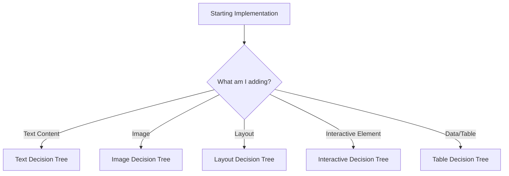

# Decision Tree: Implementation Guide

> **Purpose**: This file helps you make the right choices during slide implementation.  
> **When to use**: Step 5 (Implementation) when you're unsure which component/approach to use.

---

## 🎯 **Decision Flow**



---

## 📝 **Text Content Decision Tree**

### Q1: What type of text is this?

```
├─ Title/Heading
│  ├─ Is it a segue slide (phase transition)?
│  │  ├─ YES → Use <h1 class="segue-title"> + sub-headline
│  │  └─ NO → Continue to Q2
│  ├─ Is the text > 40 characters?
│  │  ├─ YES → Use <h1 class="r-fit-text">
│  │  └─ NO → Use <h1> (fixed 80pt)
│  └─ Regular slide heading → Use <h2> (45pt)
│
├─ Body Text
│  ├─ Is it instructions/explanations?
│  │  └─ YES → Wrap in <div class="glass-box">
│  ├─ Is it a teacher note/hint?
│  │  └─ YES → Use <div class="teacher-tip">
│  └─ Regular paragraph → Use <p> (30pt)
│
└─ Emphasis
   ├─ Key term/answer → Use <span class="highlight">
   └─ Small text → Use <p class="text-small"> (24pt)
```

### Examples:

**Segue Slide**:
```html
<h1 class="segue-title">PHASE 2:<br>CONTROLLED PRACTICE</h1>
<p style="font-size: 24px; color: white; opacity: 0.8;">
  Guided exercises to build accuracy with the target structure.
</p>
```

**Long Title**:
```html
<h1 class="r-fit-text">Identifying and Classifying Relative Clause Types in Academic Writing</h1>
```

**Short Title**:
```html
<h1>TASK 1: IDENTIFY & CLASSIFY</h1>
```

**Instructions**:
```html
<div class="glass-box">
  <p>1. Underline the relative clause.</p>
  <p>2. Label it: <span class="highlight">D</span> or <span class="highlight">ND</span>.</p>
</div>
```

---

## 🖼️ **Image Decision Tree**

### Q1: Is this a background or focal point?

```
├─ Background
│  └─ ❌ STOP! Use CSS gradient or solid color instead
│     └─ See "Abstract Continuity" design philosophy
│
└─ Focal Point
   ├─ Is it a photo/realistic image?
   │  └─ YES → Use 
   │
   ├─ Is it a diagram/chart/technical illustration?
   │  └─ YES → Use 
   │
   └─ Is it decorative/icon?
      └─ YES → Use 
```

### Examples:

**Photo (Focal Point)**:
```html

```

**Diagram**:
```html

```

**Background (CORRECT)**:
```html
<section data-background-color="#052a10">
  <!-- Content -->
</section>
```

**Background (WRONG)**:
```html
<!-- ❌ DON'T DO THIS -->
<section data-background-image="images/photo.jpg">
```

---

## 📐 **Layout Decision Tree**

### Q1: Do I need columns (side-by-side content)?

```
├─ YES → Use .row-container
│  ├─ What split ratio?
│  │  ├─ 50/50 → .col-50 + .col-50
│  │  ├─ 40/60 → .col-40 + .col-60
│  │  └─ 60/40 → .col-60 + .col-40
│  │
│  └─ What goes in each column?
│     ├─ Image → Use .inset-media or .constrained-media
│     ├─ Text → Wrap in .glass-box
│     └─ Mixed → Combine as needed
│
└─ NO → Use single-column layout
   ├─ Centered content → .glass-box (auto-centered, 800px width)
   └─ Full-width → No wrapper (just content)
```

### Examples:

**50/50 Split (Image + Text)**:
```html
<div class="row-container">
  <div class="col-50">
    
  </div>
  <div class="col-50 glass-box">
    <p>Write 50-70 words about your favourite food.</p>
  </div>
</div>
```

**40/60 Split (Small Image + Large Text)**:
```html
<div class="row-container">
  <div class="col-40">
    
  </div>
  <div class="col-60 glass-box">
    <ul>
      <li>Point 1</li>
      <li>Point 2</li>
    </ul>
  </div>
</div>
```

**Single Column (Centered)**:
```html
<div class="glass-box text-center" style="width: 800px;">
  <p>Centered instructions</p>
</div>
```

---

## ⏱️ **Interactive Element Decision Tree**

### Q1: What type of interaction?

```
├─ Countdown Timer
│  └─ Use <timer-pill duration="X">
│     └─ Ensure audio/ folder exists with blip.mp3, 30-seconds.mp3, bell.mp3
│
├─ Fragment (Incremental Reveal)
│  └─ Use class="fragment" on element
│     └─ See docs/reveal-fragments.md for advanced options
│
└─ Audio Pronunciation
   └─ Use <audio> tag with .audio-player styling
      └─ Generate with scripts/generate_vocab_audio.py
```

### Examples:

**Timer**:
```html
<timer-pill duration="4"></timer-pill>
```

**Fragment**:
```html
<ul>
  <li class="fragment">Appears first</li>
  <li class="fragment">Appears second</li>
  <li class="fragment">Appears third</li>
</ul>
```

**Audio**:
```html
<div class="audio-player">
  <audio controls src="audio/vocabulary/export.mp3"></audio>
  <p class="audio-label">🔊 Listen!</p>
</div>
```

---

## 📊 **Table Decision Tree**

### Q1: Is this tabular data?

```
├─ YES → Use <table class="slide-table">
│  ├─ Has headers?
│  │  └─ YES → Use <thead> with <th>
│  └─ Data rows → Use <tbody> with <td>
│
└─ NO → Don't use a table
   └─ Use .row-container or list instead
```

### Examples:

**Data Table**:
```html
<table class="slide-table">
  <thead>
    <tr>
      <th>Item</th>
      <th>Origin</th>
      <th>Quantity</th>
    </tr>
  </thead>
  <tbody>
    <tr>
      <td>Wheat</td>
      <td>Canada</td>
      <td>500 tons</td>
    </tr>
    <tr>
      <td>Rice</td>
      <td>Thailand</td>
      <td>300 tons</td>
    </tr>
  </tbody>
</table>
```

**NOT a Table (Use List)**:
```html
<!-- ❌ DON'T use table for layout -->
<ul>
  <li>Point 1</li>
  <li>Point 2</li>
</ul>
```

---

## 🎨 **Background Decision Tree**

### Q1: What type of background?

```
├─ Solid Color
│  └─ Use data-background-color="#hexcode"
│     └─ Examples: #052a10 (answer slides), #2a0a0a (final task)
│
├─ Gradient
│  └─ Use data-background-gradient="linear-gradient(...)"
│     └─ Example: "linear-gradient(to bottom, #283b95, #17b2c3)"
│
└─ Image/Photo
   └─ ❌ STOP! Use gradient or solid color instead
      └─ See "Abstract Continuity" design philosophy
```

### Examples:

**Answer Slide (Deep Emerald)**:
```html
<section data-background-color="#052a10">
  <!-- Answer content -->
</section>
```

**Final Task (Deep Maroon)**:
```html
<section data-background-color="#2a0a0a">
  <!-- Production task -->
</section>
```

**Gradient**:
```html
<section data-background-gradient="linear-gradient(to bottom, #1a2a45, #0a192f)">
  <!-- Content -->
</section>
```

---

## 🚦 **Common Decision Points**

### "Should I use inline styles?"

```
Q: Do I need custom styling?
├─ Font size → ❌ NO! Use documented classes or mandatory sizes
├─ Margin/spacing → ✅ YES (use .mt-20, .mt-40, .mt-50)
├─ Width → ❌ NO! Use .col-40, .col-50, .col-60
└─ Color → ❌ NO! Use .highlight or CSS variables
```

### "Should I create a new CSS class?"

```
Q: Does a documented class exist for this?
├─ YES → Use the documented class
└─ NO → Check COMPONENTS.md again
   └─ Still NO → Ask user before creating custom class
```

### "Should I use `r-fit-text`?"

```
Q: Is this an <h1> title?
├─ YES → Is the text > 40 characters?
│  ├─ YES → Use <h1 class="r-fit-text">
│  └─ NO → Use <h1> (fixed 80pt)
└─ NO → Don't use r-fit-text (only for H1)
```

### "Should I add a timer?"

```
Q: Is this a timed task slide?
├─ YES → Does the slide heading contain "TASK"?
│  └─ YES → Add <timer-pill duration="X">
└─ NO → No timer needed
```

---

## 🔍 **Troubleshooting Guide**

### Problem: Text overflows slide

**Solution**:
1. Check font size (should be 30pt for body, 45pt for H2, 80pt for H1)
2. If H1 is long (> 40 chars), add `class="r-fit-text"`
3. If still overflowing, reduce content or split into 2 slides

### Problem: Image too large

**Solution**:
1. Ensure `.inset-media` or `.constrained-media` is applied
2. Both classes enforce `max-height: 400px`
3. If still too large, check image file dimensions (should be < 1920px width)

### Problem: Layout broken

**Solution**:
1. Verify `.slide-canvas` is the top-level wrapper
2. Check `.row-container` has correct `.col-*` children
3. Ensure no percentage widths (use fixed pixel classes)

### Problem: Timer not working

**Solution**:
1. Check `audio/` folder exists with blip.mp3, 30-seconds.mp3, bell.mp3
2. Verify `<timer-pill duration="X">` syntax (not `<div class="timer-pill">`)
3. Check browser console for audio errors

---

## 📋 **Quick Decision Checklist**

Before implementing each slide, ask:

1. **Layout**: Single column or multi-column?
2. **Images**: Focal point (inset) or diagram (constrained)?
3. **Text**: Instructions (glass-box) or hint (teacher-tip)?
4. **Background**: Solid color, gradient, or default?
5. **Timer**: Is this a timed task?
6. **Tone**: Middle School (Pop & Verve) or High School (Expert/Academic)?

**If unsure, consult COMPONENTS.md for examples.**
