# Skill: Committing Project to GitHub (`committing-project-to-github`)

This skill ensures that all changes follow the project's commit standards, specifically targeting the [lesson-plan-agent](https://github.com/elwrush/lesson-plan-agent.git) repository. It enforces the exclusion of system artifacts like `desktop.ini` and mandates verbose, descriptive commit messages.

## Architectural Workflow

```mermaid
graph TD
    Start([🚀 Commit Request]) --> Discovery[1. Discovery: Git Status Audit]
    Discovery --> Exclusion[2. Exclusion: Filter desktop.ini & Temp Assets]
    Exclusion --> Staging[3. Staging: Atomic File Addition]
    Staging --> TypeSelector{4. Semantic Decision: Type & Scope?}
    TypeSelector -->|feat/fix/refactor| Formatter[5. Formatter: Construct Verbose Message]
    Formatter --> Commit[6. Commit: Local Record Creation]
    Commit --> Push[7. Push: Cloud Synchronization]
    Push --> Finish([🏁 Repository Updated])

    %% Standards
    Discovery -.->|Ref: git status| CLI
    Formatter -.->|Rule: Detailed Body| Verbose[Instructional Logic]
    TypeSelector -.->|Ref: Semantic Standard| Commits
```



## Critical Rules

> [!CRITICAL]
> **NO SYSTEM ARTIFACTS**: You MUST NEVER stage `desktop.ini` files. These are artifacts of Google Drive synchronization and do not belong in the repository.

> [!IMPORTANT]
> **VERBOSE MESSAGES**: Every commit must include a concise header AND a detailed body explaining WHY the change was made, not just WHAT was changed.

## Commit Standards

### 1. Message Format
Use the Semantic Commit format:
`<type>(<scope>): <subject>`

**Types**:
- `feat`: New feature (e.g., a new presentation template)
- `fix`: Bug fix (e.g., repairing a broken build script)
- `docs`: Documentation only
- `refactor`: Code change that neither fixes a bug nor adds a feature
- `chore`: Maintenance tasks (e.g., updating .gitignore, dependencies)

### 2. Verbose Body
Include a block of text detailing:
- What was added/changed.
- Any technical pitfalls encountered.
- Relationship to the lesson plan or presentation structure.

## Workflow Steps

### 1. Discovery & Exclusion
// turbo
```powershell
# Check status and specifically look for desktop.ini
git status
# Explicitly unstage any accidentally added desktop.ini
git reset **/desktop.ini
```

### 2. Construction
Construct the commit message based on the recent session logs or project state.
Example:
`feat(presentation): add Noir theme and fix asset synchronization`

### 3. Execution
// turbo
```bash
git add .
git commit -m "[Header]" -m "[Detailed Body]"
git push origin main
```

## Reference
- [rendering-prompts-into-mermaid](../rendering-prompts-into-mermaid/SKILL.md) - Standards for architecture diagrams.
- [using-skills.md](../../knowledge_base/using-skills.md) - General skill requirements.
