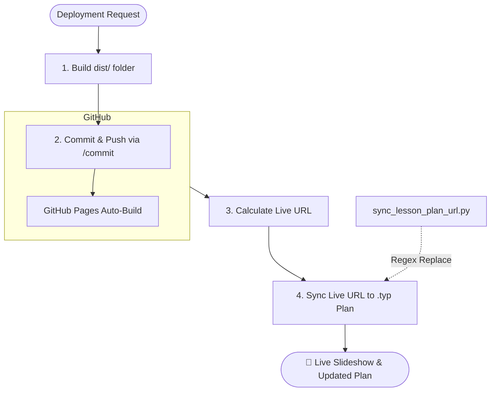

# Skill: Deploying to GitHub Pages (`deploying-to-github-pages`)

## Description
This skill automates the deployment of Reveal.js presentations to GitHub Pages. It relies on the custom GitHub Action defined in `.github/workflows/deploy.yml`, which utilizes the [elwrush/actions-gh-pages](https://github.com/elwrush/actions-gh-pages) repository to handle the final stage of publishing. It ensures that once a slideshow is pushed to the repository, the corresponding Typst lesson plan is updated with the finalized live URL.

## Critical Rules

> [!CRITICAL]
> **POST-DEPLOYMENT SYNC**: You MUST run the `sync_lesson_plan_url.py` script immediately after push. This is a critical pedagogical step to ensure the printed/PDF lesson plan correctly links to the interactive content.

> [!IMPORTANT]
> **URL PATTERN**: For this repository, the live URL is:
> `https://elwrush.github.io/lesson-plan-agent/[FOLDER-NAME]/`

## Architectural Workflow



## Workflow Steps

### 1. Build the Distribution
Run the build script to prepare the `dist/` directory. This ensures all horizontal split templates and assets are correctly bundled.
// turbo
```powershell
node scripts/build_dist.js
```

### 2. Commit and Push
Use the `/commit` workflow to push the changes to GitHub.
```bash
/commit "feat: deploy [Lesson Name] slideshow"
```

### 3. Synchronize Lesson Plan URL (CRITICAL)
Calculate the live URL and update the Typst source file. This step ensures that the PDF output of the lesson plan is functionally linked.

## Reference
- [sync_lesson_plan_url.py](scripts/sync_lesson_plan_url.py) - Script for regex-based URL replacement.
- [using-skills.md](../../knowledge_base/using-skills.md) - General skill authoring and usage guidelines.
