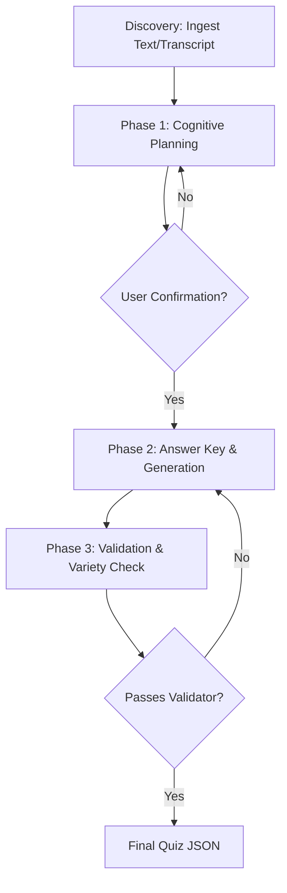

# Generating Quizzes

This skill automates the creation of high-quality, pedagogically sound assessments from reading and listening texts. It uses a structured multi-stage approach inspired by the `Questgen.ai` framework to ensure cognitive depth and plausible distractors.

## Workflow



### Phase 1: Cognitive Planning (MANDATORY)
Before generating any questions, you must:
1.  **Ask the User**: "What is the target Cognitive Level for this assessment? (e.g., Lower Order: Remembering/Understanding, or Higher Order: Analyzing/Evaluating)"
2.  **Propose a Plan**: Based on the user's input, select 3-4 distinct question types from the `REFERENCE.md` list.
    *   *Lower Order Focus*: multiple-choice, matching, gapfill, true/false.
    *   *Higher Order Focus*: inference, reordering, error-correction, antecedent.
3.  **Present the Plan**:
    ```text
    Proposed Assessment Plan:
    1. Task 1: [Type] (Targeting: [Bloom's Level])
    2. Task 2: [Type] (Targeting: [Bloom's Level])
    3. Task 3: [Type] (Targeting: [Bloom's Level])
    
    Do you approve this structure? (Y/N)
    ```
4.  **Wait for Confirmation**: Do not proceed to generation until the user approves.

### Phase 2: Generation
1.  **Generate Answer Key**: Run `python skills/generating-quizzes/scripts/generate_answer_key.py [num_mcq_questions]` to create a balanced key for any multiple-choice sections.
2.  **Draft Questions**: Generate the content following the approved plan. Ensure every question is grounded in an "Assessment Anchor" from the text.
3.  **Variety Constraint**: The quiz MUST contain at least one task type *other than* `mcq` or `boolean`.

### Phase 3: Validation
1.  **Run Validator**: `python skills/generating-quizzes/scripts/validate_quiz.py [path_to_json]`
    *   *Note*: The validator will fail if the quiz is purely MCQ/True-False.
2.  **Check Distribution**: `python skills/generating-quizzes/scripts/verify_distribution.py [path_to_json]` (for MCQ sections).

## Design Standards

## Design Standards

-   **Plausible Distractors**: Distractors must be semantically related to the correct answer but factually incorrect based on the text.
-   **No Ordinals**: Choices must not contain "A)", "1.", etc.
-   **Bloom's Taxonomy**: Questions should range from "Remembering" to "Evaluating" based on task requirements.

## Troubleshooting

-   **Hallucination**: If questions reference information not in the text, reinforce the "Assessment Anchor" constraint in the prompt.
-   **Predictable Answers**: Ensure "Answer Mention Order" is varied (don't always make 'C' the correct answer).
