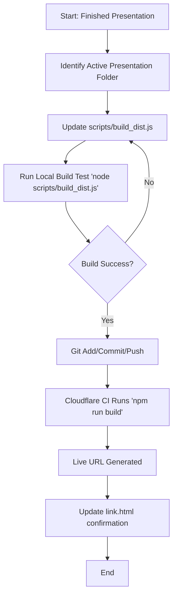

# Skill: Hosting Presentations (`hosting-presentations`)

## Description
This skill handles the publishing of HTML presentations to the **Cloudflare Pages Lesson Library**. It strictly enforces a **Whitelist Build Strategy** to prevent "Asset Too Large" errors and ensure only the active presentation is deployed.

## Critical Rules
> [!IMPORTANT]
> **NEVER DEPLOY THE ROOT DIRECTORY (`.`)**.
> You must ALWAYS build a clean `dist/` directory containing only the specific presentation files.

## Workflow

### 1. Configuration
1.  **Locate Active Folder**: Identify the specific subfolder containing the `index.html` presentation (e.g., `18-01-26_Global-Logistics...`).
2.  **Update Build Script**:
    - Open `scripts/build_dist.js`.
    - Update `PRESENTATION_DIR` to point to the active folder.
    - Ensure `INCLUDES` contains necessary shared assets (`js`, `images`, `audio`).

### 2. Local Verification
1.  **Run**: `node scripts/build_dist.js`
2.  **Verify**: Check that the `dist/` folder contains:
    - `index.html` (at the root)
    - `images/`, `js/`, `audio/` (folders)
    - **NO** hidden files (`.git`, `node_modules`).

### 3. Deployment
1.  **Commit**: Commit the updated `build_dist.js` and any presentation changes.
    - `git add scripts/build_dist.js [presentation_folder]`
    - `git commit -m "chore: target [presentation_name] for deployment"`
    - `git push origin main`
2.  **Wait**: Cloudflare will detect the commit, run `npm run build` (triggering your script), and deploy the `dist/` folder.

### 4. confirmation
1.  Update the `link.html` or similar helper file to point to the live worker URL (e.g., `https://lesson-plan-agent.elwrushmel.workers.dev/`).
2.  Provide this link to the user.
