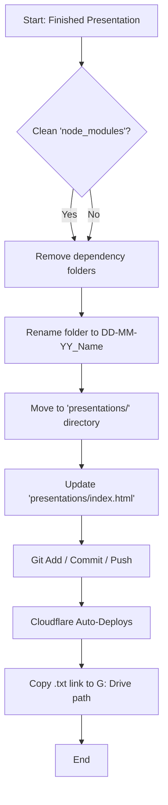

# Skill: Hosting Presentations (`hosting-presentations`)

## Description
This skill handles the publishing of HTML presentations to the **Cloudflare Pages Lesson Library**. It ensures that new lessons are added to the persistent `presentations/` folder, the index menu is updated, and the changes are pushed to GitHub for automatic deployment.

## Context
Use this skill when:
- An HTML presentation has been generated (e.g., in `inputs/`).
- The user wants to "publish" or "host" the lesson.
- The user needs a live URL for the classroom.

## Prerequisites
- **Git Repository**: Must be connected to Cloudflare Pages (`lesson-plan-agent`).
- **Directory Structure**:
    - `presentations/` (Root for Cloudflare)
    - `presentations/index.html` (Menu)
- **Local Sync Path**: `G:\My Drive\A CLASSES- ED - TERM 2\M24A - M3-3A`

## Workflow



### 1. Preparation
Ensure the presentation is lightweight (CDN links, no local `node_modules`).

### 2. Standardization
Rename the folder to the strict date format: `DD-MM-YY_Descriptive-Name`.

### 3. Integration
1.  Move the folder into `presentations/`.
2.  Add a generic HTML link card to `presentations/index.html`.

### 4. Deployment & GDoc Link
1.  Execute the Git commands to trigger the Cloudflare build.
    ```bash
    git add presentations/
    git commit -m "feat: publish lesson [DATE]"
    git push origin main
    ```
2.  **Generate GDoc Button**: 
    - Create a helper `.html` file containing a styled link button to the live Cloudflare URL (example: `https://lesson-plan-agent.pages.dev/DD-MM-YY_Name/`).
3.  **Push to GDocs**: Run the deterministic script `python scripts/push_to_gdocs.py --file [helper.html] --name [doc_name]` to convert the button into a native Google Doc in the target folder.
    > [!NOTE]
    > **ADC Required**: Ensure Application Default Credentials (ADC) are active for the script to function correctly.
