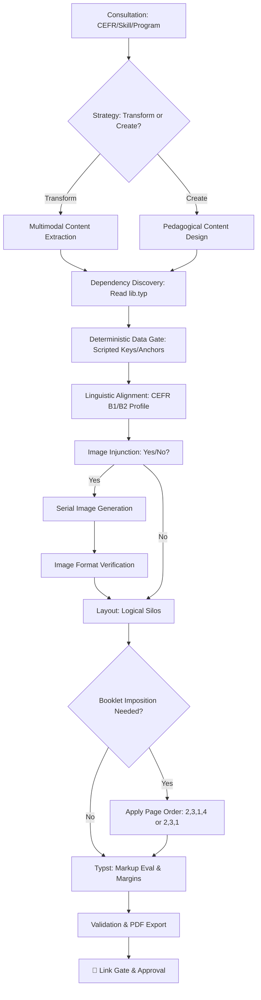

# Producing Educational Materials

## Purpose
Guide the transition from raw educational requirements to print-ready, professionally branded PDF worksheets. Consolidates pedagogical design with high-density Typst production.

## Workflow Visualization


---

## Workflow

### Step 1: Requirements Gathering & Consultation
You MUST consult with the user on these core constraints:
- **CEFR Level**: A1-C2 (mandatory).
- **Skill/System**: Reading, Listening, Writing, Speaking, Grammar, Vocabulary, or Pronunciation.
- **Duration**: Target lesson length.
- **Program Selection**: **CRITICAL**. Prompt user to choose between **Bell** and **Intensive**. 
  - *Assets Location*: Branded straps are found in `@local/bell-sheets:0.1.0/images/`.
- **Image Choice**: Prompt user: *"Would you like to include custom images/illustrations for this worksheet?"*
- **Quiz Choice**: Prompt user: *"Would you like quiz questions developed for this worksheet? (Yes/No)"*.
  - **Action**: If "Yes", you MUST execute Step 2 (Deterministic Gate).

### Step 2: Deterministic Data Gate (If Quiz is 'Yes')
To prevent LLM "probabilistic laziness" in option placement:
1. **Script First**: Write and run a Python script to generate randomized answer keys (e.g., `[1, 0, 1, 1...]`) and select anchor quotes from the text.
2. **Injunction**: Force the LLM to write questions where the correct answer **MUST** align with the indices provided by the script.

### Step 3: Dependency Discovery (Pre-Production)
Before writing any code, you MUST verify the environment:
- **Library Audit**: Use `view_file` on the target library (e.g., `@local/bell-sheets:0.1.0/lib.typ`). 
  - **Verify**: Correct function names and argument types.
  - **Override**: If hardcoded defaults (like image centering) interfere with the mission-critical layout, modify the `@local` library file directly.

### Step 4: Content Strategy
Determine if you are **transforming existing materials** or **writing brand new content**.
- **Linguistic Alignment**: Follow the **[B1 Profile](B1-LINGUISTIC-PROFILE.md)** or **[B2 Profile](B2-LINGUISTIC-PROFILE.md)**.
- **Natural Flow Layout**: Do NOT force material into a prescribed page count. Allow content to flow naturally across pages.
- **Logical Ordering (Main Worksheet)**:
  1. `[Header & Hero Strap]`
  2. `[Story/Reading Text]` (Flows naturally across 1-2 pages)
  3. `[Page Break]`
  4. `[Question Block]` (Queries MUST be bold-faced using `#strong[]`)
  5. `[Page Break]`
  6. `[Full Answer Key]` (With explanations)

- **Modular Output**: Publish writing tasks as separate `.typ` files (e.g., `B1-Writing.typ`) to keep the reading/literacy focus of the main worksheet clean.

- **Booklet Imposition (A5 on A4)**:
  - For **4-page booklets**, the PDF order MUST be: **2, 3, 1, 4** (Inside Spread, then Front/Back cover).
  - For **3-page booklets**, the PDF order is: **2, 3, 1** (Inside Spread, then Front cover). Page 4 is assumed blank.
  - For **2-page documents** (Leaflets), the PDF order is: **1, 2**.

### Step 5: Design Strategy (Editorial Standard)
Apply the **Creative/Editorial** approach to maximize engagement:
1. **Photocopy-Hardened**: Use **14pt** (yields ~10pt on A5) for standard text. **12pt** is the absolute minimum for high-density layouts.
2. **Cinematic Headers**: Use full-width banners with overlay text.
3. **Narrative Integrity**: Use **Single-Column** for stories; use 2-columns for news/analytical content.
4. **Answer Key UX**:
   - Place B1 and B2 keys on **Separate Pages**.
   - Include a **Summary Guide** (e.g., *(1) B, (2) A*) at the top of each page.

### Step 6: Typst Production (Global Components)
All worksheets MUST use the global `@local/bell-sheets:0.1.0` package.

#### Layout & Production Rules:
- **Handwriting Space**: Use **1.1cm** for full lines; **0.9cm** is the absolute minimum for compact tasks.
- **Handwriting Lines**: Use **Dark Gray (#333333)** to survive low-contrast photocopying.
- **External Text Loading**: When loading text with italics/bold from files:
  - **Fix**: Use `#eval(read("file.txt").replace("[", "\[").replace("]", "\]"), mode: "markup")`.
- **Identity Blocks**: Place on a **separate new page** for major production tasks.
- **Explicit Margins**: **MANDATORY**. `#set page(margin: (x: 2cm, top: 1.25cm, bottom: 1.25cm))`.

### Step 6: Rendering & Validation
1. **Compile**:
   ```powershell
   typst compile "path/to/source.typ" "inputs/[folder]/published/DD-MM-YYYY-[LEVEL]-[TITLE].pdf" --root "."
   ```
2. **Validate**:
   ```powershell
   python scripts/validate_worksheet.py "path/to/source.typ" --mode [bell|intensive]
   ```

### Step 7: 🏁 THE LINK GATE
> [!CRITICAL]
> **YOU MUST PROVIDE A CLICKABLE LINK TO THE PDF.**
> Post the link using the `file:///` protocol. Do NOT proceed until the user approves the visual output.

---

## Reference Material
- **B1 Standard**: `~/.gemini/antigravity/skills/producing-educational-materials/B1-LINGUISTIC-PROFILE.md`
- **B2 Standard**: `~/.gemini/antigravity/skills/producing-educational-materials/B2-LINGUISTIC-PROFILE.md`
- **Global Docs**: `~/.gemini/antigravity/skills/producing-educational-materials/REFERENCE.md` (Coming Soon)
- **Shared Components**: `@local/bell-sheets:0.1.0/lib.typ`
