# Producing Educational Materials

## Purpose
Guide the transition from raw educational requirements to print-ready, professionally branded PDF worksheets. Consolidates pedagogical design with high-density Typst production. **STRICT RULE: NEVER abbreviate, change, or truncate source text. Professional materials must maintain 100% instructional integrity.**

## Workflow Visualization

```mermaid
graph TD
    subgraph "Phase 1: Analysis & Strategy"
        A[Consultation: CEFR/Skill/Prog/Dur/Images/Quiz/Writing] --> B{Strategy: Transform or Create?}
        B -->|Transform| C[Multimodal Content Extraction]
        B -->|Create| D[Pedagogical Content Design]
        C & D --> LP[Linguistic Alignment: CEFR Profile Sync]
    end

    subgraph "Phase 2: Dependency & Logic"
        LP --> DP[Dependency Discovery: Verify lib.typ & Paths]
        DP --> DG{Quiz/Writing Required?}
        DG -->|Yes| DK[Deterministic Gate: Scripted Keys/Anchors/Prompts]
        DG -->|No| IM
        DK --> IM
    end

    subgraph "Phase 3: Visuals & Layout"
        IM[Image Injunction: Search Pixabay?] -->|Yes| SIG[Serial Image Generation & Verification]
        IM -->|No| LOG
        SIG --> LOG[Layout: Logical Sequential Silos]
        LOG --> PH[Page 1 Rules: Logo + v0.1cm + Badges Left + HeroStrap]
        PH --> SP[Strict Spacing: 0.55em Body / 0.9cm Writing]
    end

    subgraph "Phase 4: Production & Export"
        SP --> BI{Booklet Needed?}
        BI -->|Yes| BO[Apply Imposition: 2,3,1,4 / 2,3,1]
        BI -->|No| TE[Typst Execution: Markup Eval]
        BO --> TE
        TE --> VAL[Validation: Code & Content Audit]
        VAL --> LG[🏁 Link Gate & Approval]
    end

    style PH fill:#f9f,stroke:#333,stroke-width:2px
    style LP fill:#bbf,stroke:#333,stroke-width:2px
    style DP fill:#bbf,stroke:#333,stroke-width:2px
```


---

## Workflow

### Step 1: Requirements Gathering & Consultation
You MUST consult with the user on these core constraints:
- **CEFR Level**: A1-C2 (mandatory).
- **Skill/System**: Reading, Listening, Writing, Speaking, Grammar, Vocabulary, or Pronunciation.
- **Duration**: Target lesson length.
- **Program Selection**: **CRITICAL**. Prompt user to choose between **Bell** and **Intensive**. 
  - *Assets Location*: Branded straps found in `C:\Users\elwru\AppData\Roaming\typst\packages\local\bell-sheets\0.1.0\images\`.
- **Image Choice**: Prompt user: *"Would you like to include custom images/illustrations for this worksheet?"*
- **Badge Choice**: Never include the lesson duration (e.g., "46 MINS") in a badge. Badges are for CEFR levels or Topic tags only.
- **Mission Redesign (Relevance Mandate)**:
    -   **Intro Text**: Must include a hook explaining the relevance to their exam (e.g., "In your PET test you'll probably have to speak about holidays. This lesson will help you do that.").
    -   **Readability**: ALWAYS apply a dark vignette or gradient overlay to the Mission slide (`data-background-gradient`) to ensure white text remains readable over the background video.
    -   **Requirement**: You MUST always explain the relevance of the lesson to the student's end-of-year goals (**B1 PET for Schools** or **B2 First for Schools**).
    -   **Validation**: If the relevance is not clear, ask the user before generating the Mission slide.
    -   **Structure**: 3 distinct boxes (square badges) for core objectives, each with an icon (plane, book, pen, etc.).
    -   **System Logic**: Adhere to `knowledge-base/using-skills.md` for role-based specialization and ensure any requirement changes are mapped via `skills/rendering-prompts-into-mermaid`.
  - *Reference*: See `knowledge-base/using-skills.md` for standard architecture and `skills/rendering-prompts-into-mermaid` for visualizing this requirement in the workflow.
- **Writing/Critical Thinking Choice**: **MANDATORY**. Prompt user: *"Would you like to include an extension writing or critical thinking task? (Yes/No)"*.
  - **Action**: If "Yes", you MUST design a task aligned with the CEFR profile. If "No", do NOT invent any personal response or analysis tasks.
  - **Action**: If "Yes", you MUST execute Step 2 (Deterministic Gate).

### Step 2: Deterministic Data Gate (If Quiz is 'Yes')
To prevent LLM "probabilistic laziness" in option placement:
1. **Script First**: Write and run a Python script to generate randomized answer keys (e.g., `[1, 0, 1, 1...]`) and select anchor quotes from the text.
2. **Injunction**: Force the LLM to write questions where the correct answer **MUST** align with the indices provided by the script.

### Step 3: Dependency Discovery (Pre-Production)
Before writing any code, you MUST verify the environment:
- **Library Audit**: Use `view_file` on the target library: `C:\Users\elwru\AppData\Roaming\typst\packages\local\bell-sheets\0.1.0\lib.typ`.
  - **Verify**: Correct function names and argument types.
- **Path Verification**: Ensure images are downloaded using Pixabay Skill: `C:\PROJECTS\LESSONS AND SLIDESHOWS 2\skills\searching-pixabay\scripts\download_image.py`.

### Step 4: Content & Layout Strategy
- **Rule: Verbatim Mandate**: **CRITICAL**. You MUST use the source text EXACTLY as provided in the raw files.
  - NEVER abbreviate long definitions.
  - NEVER truncate lists of examples.
  - NEVER change punctuation or tone.
  - If content is too long for the page, **find a layout solution** (columns, smaller standard font 12pt, or natural overflow). DO NOT edit the text.
- **Linguistic Alignment**: Follow the **[B1 Profile](B1-LINGUISTIC-PROFILE.md)** or **[B2 Profile](B2-LINGUISTIC-PROFILE.md)**.
- **Rule: Paragraph Numbering**: **MANDATORY**. 
  - All reading texts MUST have numbered paragraphs to facilitate classroom reference.
  - Prefix every paragraph with a bold, maroon number: `#text(fill: maroon, weight: "bold")[[1]]`.
  - Do NOT use automatic CSS counters; hardcode the numbers in the Typst file for stability.
- **Rule: Multiple Choice Formatting**: **MANDATORY**. 
  - NEVER use run-on lines for choices (e.g., `A. One B. Two`).
  - Use a nested `#enum(numbering: "A.", ..)` for vertical choices (one per line).
  - Use a 2-column `#grid(columns: (1fr, 1fr), ...)` if choices are very short (e.g., single words, dates) and space is a concern.
- **Rule: Single-Column & Natural Flow (Starting State)**: **MANDATORY**. 
  - ALWAYS start the first draft with a **single-column layout** for all materials.
  - ALWAYS allow content to **flow naturally across pages**. 
  - **STRICTLY NO manual page breaks** between tasks or sections in the initial draft.
  - *Rationale*: The user will review the content spread first and then request specific booklet impositions or page adjustments in subsequent turns.

### Step 5: Design Strategy & Styling
For detailed typography, spacing, and branding standards, refer to **[styling.md](references/styling.md)**.

### Step 6: Rendering & Validation
1. **Compile**:
   ```powershell
   typst compile "inputs/[folder]/[filename].typ" "inputs/[folder]/published/DD-MM-YYYY-[LEVEL]-[TITLE].pdf" --root "."
   ```
   - **Naming Rule**: **NEVER** add version suffixes (e.g., `-v1`, `-v2`) to the PDF filename. 
   - **Overwrite Mandate**: ALWAYS overwrite the original target PDF to provide a single, consistent link for user review.
2. **Validate**:
   ```powershell
   # Note: validate_worksheet.py fallback
   python scripts/validate_text.py "path/to/source.typ"
   ```

### Step 7: Typst Debugging & Resilience
If compilation fails:
1.  **Extract Error**: Identify the specific delimiter or syntax error from the Typst output.
2.  **Codebase Search**: Search `C:\PROJECTS\WRITING-ASSESSMENT\temp_typst_repo\` for the error message or related syntax tests.
3.  **Pattern Match**: Find how the Typst compiler expects that specific structure to be formatted.
4.  **Resolve**: Apply the verified syntax to the `.typ` file.
    *   *Common Fix*: For parentheses in lists causing "unclosed delimiter" errors (e.g., `#gap ( ___ )`), use the text function: `#gap #text("(___)")`. This isolates the delimiters from the parser.
5.  **Documentation**: Add the fix pattern to `references/styling.md` or this skill.

### Step 8: 🏁 THE LINK GATE
> [!CRITICAL]
> **YOU MUST PROVIDE A CLICKABLE LINK TO THE PDF.**
> Post the link using the `file:///` protocol. Do NOT proceed until the user approves the visual output.

---

## Programmatic Hooks
- `scripts/resolve_typst_error.py`: (Development Pending) A script to automate searching the Typst codebase for error patterns.

## Reference Material
- **Skill Architecture Standard**: `C:\PROJECTS\LESSONS AND SLIDESHOWS 2\knowledge_base\using-skills.md` (MUST follow for all skill updates).
- **Visualization Tool**: `C:\PROJECTS\LESSONS AND SLIDESHOWS 2\skills\rendering-prompts-into-mermaid\SKILL.md` (Use for updating Mermaid diagrams).
- **Styling Guide**: `C:\PROJECTS\LESSONS AND SLIDESHOWS 2\skills\producing-educational-materials\references\styling.md` (Design and Branding standards).
- **B1 Standard**: `C:\PROJECTS\LESSONS AND SLIDESHOWS 2\skills\producing-educational-materials\B1-LINGUISTIC-PROFILE.md`
- **B2 Standard**: `C:\PROJECTS\LESSONS AND SLIDESHOWS 2\skills\producing-educational-materials\B2-LINGUISTIC-PROFILE.md`
- **Typst Library**: `C:\Users\elwru\AppData\Roaming\typst\packages\local\bell-sheets\0.1.0\lib.typ`
- **Pixabay Script**: `C:\PROJECTS\LESSONS AND SLIDESHOWS 2\skills\searching-pixabay\scripts\download_image.py`
