# Writing Lesson Plans

This skill guides you through an 8-step interactive workflow to create a lesson plan.

## Prerequisites

- Access to `knowledge_base/shapes/` directory for modular shape definitions
- Materials in `/inputs` subfolder (or user will design new materials)

## Visual Process

```mermaid
graph TD
    Start([LP Request]) --> Ingest[1. Ingest Materials]
    Ingest --> Roadmap[2. Visual Roadmap Gate]
    Roadmap --> Presentation[3. Generate Presentation]
    Presentation --> Write[4. Write Typst Lesson Plan]
    Write --> Validate[5. Validate & Compile]
    Validate --> Finish([🏁 Final PDF & Live Slideshow])
```



## Workflow

### Step 1: Ingest & Analyze Materials
Analyze the raw text, questions, and goals. Identify every distinct task (Task A, B, C, etc.).

### Step 2: The Visual Roadmap Gate (MANDATORY)
Before generating any JSON or Typst, you **MUST** present a slide-by-slide Markdown Roadmap. 

**Requirements for the Roadmap:**
- **Zero Conflation**: Every task must have its own dedicated Bridge, Task, and Answer slide.
- **Phase Markers**: Group slides into logical Phases.
- **Student-Centric Voice**: All slide titles must be action-oriented and student-facing.
- **Pro-Tips**: Explicitly list the tips for every Bridge slide.
- **Image Prompts**: Detailed prompts for Pixabay/Sourcing.

**STOP AND WAIT**: Do not proceed until the user approves the Roadmap.

### Step 3: Generate Presentation
Build the `presentation.json` and source assets using the **approved Roadmap** as your only source of truth.

### Phase 2: Pedagogical Design (The Lesson Plan Gate)
**Goal**: Define the lesson shape and flow.
1.  **Shape Selection**: Consult `REFERENCE.md` and choose the appropriate shape (A-J).
2.  **Draft Plan**: Write the Typst Lesson Plan (`lesson_plan.typ`).
3.  **Validate**: Run `python skills/writing-lesson-plans/hooks/plan-validator.py [Lesson]`.
4.  **Compile**: Generate the PDF using `typst compile inputs/[Lesson]/lesson_plan.typ`.
5.  **GATE**: **STOP AND WAIT**. Present the PDF to the user and wait for explicit approval before proceeding to Visual Mapping.

**Critical Formatting Rules:**
1.  **Slideshow Link Placement**: The `#slideshow_link(...)` function **MUST** be placed exactly between the `#differentiation_box(...)` and the start of the `#stage_table(...)`. Never at the end.
2.  **Stage Header Integrity**: The names of the stages (e.g., "Lead-in", "Reading for Detail", "Post-reading Speaking Task") **MUST** strictly match the `Shape Reference` in `REFERENCE.md`. Do not invent new stage names like "Phase 1" or "Context".

#### Pre-teach Vocabulary Format (Shape E)

You **MUST** select exactly **5 words** from the source text.

```
### 1. word /phonetic/: English context sentence (implies meaning).
// NOTE: Thai translations are BANNED - use only English context sentences.
```

**Mandate: High-Context Sentences**
Context sentences MUST be descriptive enough to reveal the word's meaning through narrative action or contrast. Avoid "weak" sentences that just use the word without explaining its nature.

*   ❌ **Weak**: The thief seized the bag and ran. (Doesn't show *how*)
*   ✅ **Strong**: The thief **seized** the bag from the old lady's hand so suddenly that she fell over. (Implies force and speed)

#### Image Prompts (MANDATORY)

For every lesson plan, you **MUST** provide a section with detailed image prompts for key stages (Lead-in, Gist, Detail, etc.).

**Format:**
```
**Image Prompts:**
- **Lead-in:** [Subject], [Style], [Mood], [Lighting]
- **Key Moment:** [Subject], [Style], [Mood], [Lighting]
```

---

## Reference Files

- [REFERENCE.md](REFERENCE.md) - Shape summaries
- [knowledge_base/shapes/](file:///c:/PROJECTS/LESSONS%20AND%20SLIDESHOWS%202/knowledge_base/shapes/) - Complete shape definitions
